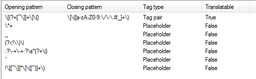

# Trados File Type Setting for DocFx Subset of Markdown

## Introduction

The goal is to translate DocFx markdown files in [Trados](https://www.sdltrados.com/).

This file type setting was created for parsing a subset of markdown used in some DocFx projects.  It will not work for all flavors of markdown, or even all projects using DocFx.  At least it's a good start.  Feel free to fork it and customize it for your project requirements.

Trados does not support markdown file parsing.  I have been submitting feature requests and feedback in their surveys to support it.  Please let SDL know about the demand for this support by providing them feedback in surveys.

## Syntax Assumptions

The goal was to parse only a subset of markdown used for the [Ignite UI for Angular](https://github.com/IgniteUI/igniteui-docfx) help.  Because the scope is only these files, the following assumptions are made:

* There is no HTML in the translatable content.
* Tables follow a `| column1 | column2 | column3 |` syntax.
* There are no markdown errors in the source file that would cause the markdown to be rendered incorrectly or be invalid.
* There are localizable metadata fields `title:`, `_description:`, `_keywords:`.
* There are no line breaks in the middle of sentences.  Because this is a regular expression delimited file, line breaks will break the translation units.

## Explanation of Rules

### Document Structure

The patterns written below are adapted to appear correctly in rendered markdown.  They should not be copied and pasted from this readme, as certain characters had to be escaped in various ways.

| Opening Pattern  | Closing Pattern | Explanation |
| ----- | ----- | ----- |
| `^[\s]*#{1,6}` | `$` | `<h1>` through `<h6>` header elements. |
| `^[\s]*\d+\.[\s]*` | `$` | Ordered list items (ex. `1.`). |
| `` ```(\[\s\S](?!```))* `` | `` \s*``` `` | Code blocks. |
| `^title:\s+` | `$` | `title` metadata. |
| `^_description:\s+` | `$` | `description` metadata. |
| `^_keywords:\s+` | `$` | `keywords` metadata. |
| `<p class="highlight">` | `<\/p>` | The first paragraph in a help topic for [Ignite UI for Angular](https://github.com/IgniteUI/igniteui-docfx). |
| `^[\s]*\*\s+` | `$` | Unordered list items (ex. `* List item`). |
| `^[\s]*>\s+(?!\[)` | `$` | Notes or quoted text (ex. `> Note text`). |
| `^[\s]*\-\s+` | `$` | Unordered list items (ex. `- List item`). |
| `^\s*(?=[A-Za-z]`&#x7c;`\*\*`&#x7c;`\`&#x7c;`)(?!title)` | `$` | Regular text paragraphs.  I included the possibility of a line starting with `**`, and removed the rules conflict for the `title:` metadata. |

### Inline Tags

| Opening Pattern  | Closing Pattern | Explanation |
| ----- | ----- | ----- |
| `\[(?=[^\]]+\]\()` | `\]\([a-zA-Z0-9:\/\-\.#_]+\)` | Link tags (ex. `[Link text](link.url)`). |
| `\*+` |  | Bold (`*`) or italic (`**`) tags. |
| `_` |  | Italic (`_`) tags. |
| `!\[[^\]]*\]\([^)]+\)` |  | Image (``) tags. |
| `(?<!\\)\`&#x7c; |  | Table delimiters. |
| `:?\-+\-+:?\s*(?=\`&#x7c;`)` |  | Syntax to separate table headers from table content. |
| `` ` `` |  | Backticks that identify code words. |

## Warning About Trados File Type Setting Import

At least in Trados Studio 2014, which is what I used to create this setting, the Import button will **overwrite** the first existing file type definition for the specified file extension.  This can be very dangerous, and can cause you to lose work.  Because of that, I will include images of the settings dialog, as that was the only way I found to properly import or copy the settings if you already have a `*.md` file type.  However, there are some advanced settings that will not be shown in the images, so you may want to check the .sdlftsettings file in a text editor.

## File Type Setting Images




## Garbage In, Garbage Out

If a source file has the wrong encoding or is otherwise corrupted, it will not parse properly.  Please ensure the source file is valid.  For example, with [Ignite UI for Angular](https://github.com/IgniteUI/igniteui-docfx), I had to change the encoding of the files to UTF-8 and fix markdown syntax errors.

## Known Issues

* Lines starting with `_` will not parse.  Adding this to the document structure rules conflicts with the inline tag rules and the file will not open.
* Multi-line HTML tags may appear in the parsed content.  **Workaround**: Lock or skip these TUs in the .sdlxliff file, or remove the line breaks in the source file.
* HTML will not be parsed.  **Workaround**: Copy or rename the file with a *.html extension and translate it as HTML.
* Tooltip text for images are not translatable.  Trying to create a tag pair for this resulted in an error in Trados.